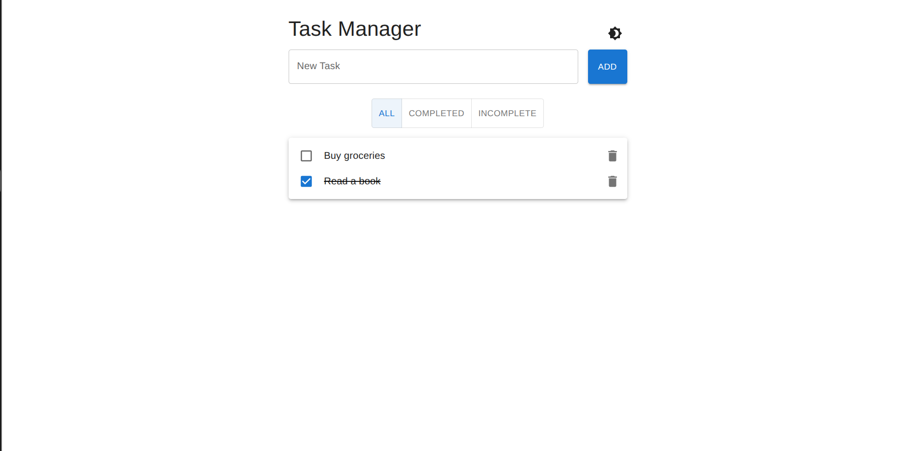
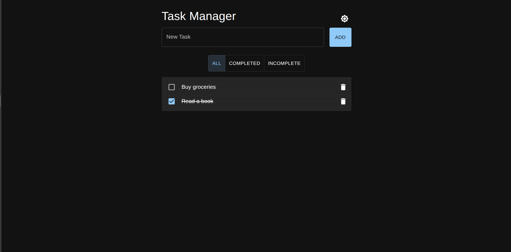

# 📝 Task Manager (Frontend Only)

A simple task manager built with **React**, **Vite**, and **Material UI**.

## 🚀 Features

- ✅ Add, complete, and delete tasks
- 🔍 Filter tasks (All, Completed, Incomplete)
- 🌗 Light/Dark mode toggle with sun/moon icon
- ⚠️ Validation (task title must not be empty)

## 🛠️ Tech Stack

- React + Vite
- Material UI (MUI)
- JavaScript (ES6+)

## 📦 Getting Started

```bash
# Clone the repo
mkdir frontend
cd task-manager

# Install dependencies
npm install

# Run development server
npm run dev
```

## 🖼️ App Preview

### 🌞 Light Mode



### 🌙 Dark Mode


